# Testing

> [!NOTE]  
> Return back to the [README.md](README.md) file.

## Code Validation

### HTML

I have used the recommended [HTML W3C Validator](https://validator.w3.org) to validate all of my HTML files.

| Directory | File | URL | Screenshot | Notes |
| --- | --- | --- | --- | --- |
| templates | [collection_confirm_delete.html](https://github.com/minhqla/sole-archive/blob/main/templates/collection/collection_confirm_delete.html) | [W3C Markdown Validation](https://validator.w3.org/nu/#textarea) |  | No errors |
| templates | [collection_detail.html](https://github.com/minhqla/sole-archive/blob/main/templates/collection/collection_detail.html) | [W3C Markdown Validation](https://validator.w3.org/nu/#textarea) |  | No errors |
| templates | [collection_form.html](https://github.com/minhqla/sole-archive/blob/main/templates/collection/collection_form.html) | [W3C Markdown Validation](https://validator.w3.org/nu/#textarea) |  | No errors |
| templates | [collection_list.html](https://github.com/minhqla/sole-archive/blob/main/templates/collection/collection_list.html) | [W3C Markdown Validation](https://validator.w3.org/nu/#textarea) |  | No errors |
| templates | [sneaker_form.html](https://github.com/minhqla/sole-archive/blob/main/templates/collection/sneaker_form.html) | [W3C Markdown Validation](https://validator.w3.org/nu/#textarea) |  | No errors |
| templates | [home.html](https://github.com/minhqla/sole-archive/blob/main/templates/home.html) | [W3C Markdown Validation](https://validator.w3.org/nu/#textarea) |  | No errors |
| templates | [login.html](https://github.com/minhqla/sole-archive/blob/main/templates/account/login.html) | [W3C Markdown Validation](https://validator.w3.org/nu/#textarea) |  | No errors |
| templates | [signup.html](https://github.com/minhqla/sole-archive/blob/main/templates/account/signup.html) | [W3C Markdown Validation](https://validator.w3.org/nu/#textarea) |  | No errors |

### CSS

I have used the recommended [CSS Jigsaw Validator](https://jigsaw.w3.org/css-validator) to validate all of my CSS files.

| Directory | File | URL | Screenshot | Notes |
| --- | --- | --- | --- | --- |
| static | [style.css](https://github.com/minhqla/sole-archive/blob/main/static/css/style.css) | [W3C CSS Validation](https://jigsaw.w3.org/css-validator/validator) |  | No errors |

### Python

I have used the recommended [PEP8 CI Python Linter](https://pep8ci.herokuapp.com) to validate all of my Python files.

| Directory | File | URL | Screenshot | Notes |
| --- | --- | --- | --- | --- |
| collection | [admin.py](https://github.com/minhqla/sole-archive/blob/main/collection/admin.py) | [PEP8 CI Link](https://pep8ci.herokuapp.com/https://raw.githubusercontent.com/minhqla/sole-archive/main/collection/admin.py) |  | No errors |
| collection | [forms.py](https://github.com/minhqla/sole-archive/blob/main/collection/forms.py) | [PEP8 CI Link](https://pep8ci.herokuapp.com/https://raw.githubusercontent.com/minhqla/sole-archive/main/collection/forms.py) |  | No errors |
| collection | [models.py](https://github.com/minhqla/sole-archive/blob/main/collection/models.py) | [PEP8 CI Link](https://pep8ci.herokuapp.com/https://raw.githubusercontent.com/minhqla/sole-archive/main/collection/models.py) |  | No errors |
| collection | [tests.py](https://github.com/minhqla/sole-archive/blob/main/collection/tests.py) | [PEP8 CI Link](https://pep8ci.herokuapp.com/https://raw.githubusercontent.com/minhqla/sole-archive/main/collection/tests.py) |  | No errors |
| collection | [urls.py](https://github.com/minhqla/sole-archive/blob/main/collection/urls.py) | [PEP8 CI Link](https://pep8ci.herokuapp.com/https://raw.githubusercontent.com/minhqla/sole-archive/main/collection/urls.py) |  | No errors |
| collection | [views.py](https://github.com/minhqla/sole-archive/blob/main/collection/views.py) | [PEP8 CI Link](https://pep8ci.herokuapp.com/https://raw.githubusercontent.com/minhqla/sole-archive/main/collection/views.py) |  | No errors |
| config | [settings.py](https://github.com/minhqla/sole-archive/blob/main/config/settings.py) | [PEP8 CI Link](https://pep8ci.herokuapp.com/https://raw.githubusercontent.com/minhqla/sole-archive/main/config/settings.py) |  | No errors |
| config | [urls.py](https://github.com/minhqla/sole-archive/blob/main/config/urls.py) | [PEP8 CI Link](https://pep8ci.herokuapp.com/https://raw.githubusercontent.com/minhqla/sole-archive/main/config/urls.py) |  | No errors |
|  | [manage.py](https://github.com/minhqla/sole-archive/blob/main/manage.py) | [PEP8 CI Link](https://pep8ci.herokuapp.com/https://raw.githubusercontent.com/minhqla/sole-archive/main/manage.py) |  | No errors |

## Responsiveness

I've tested my deployed project to check for responsiveness issues.

| Page | Mobile | Tablet | Desktop | Notes |
| --- | --- | --- | --- | --- |
| Register |  | 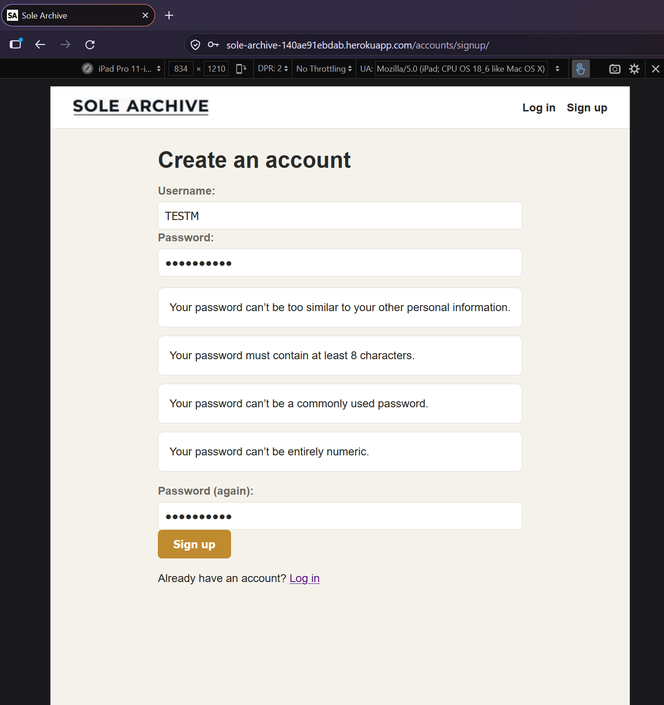 |  | Works as expected |
| Login |  | 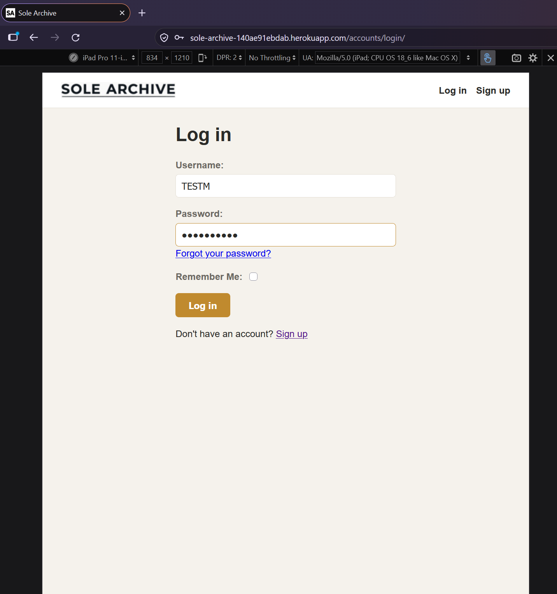 |  | Works as expected |
| Home |  | 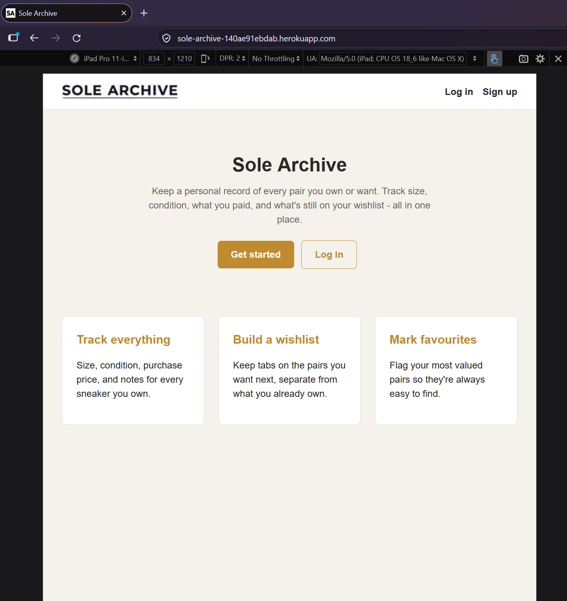 |  | Works as expected |
| Add Sneaker |  | 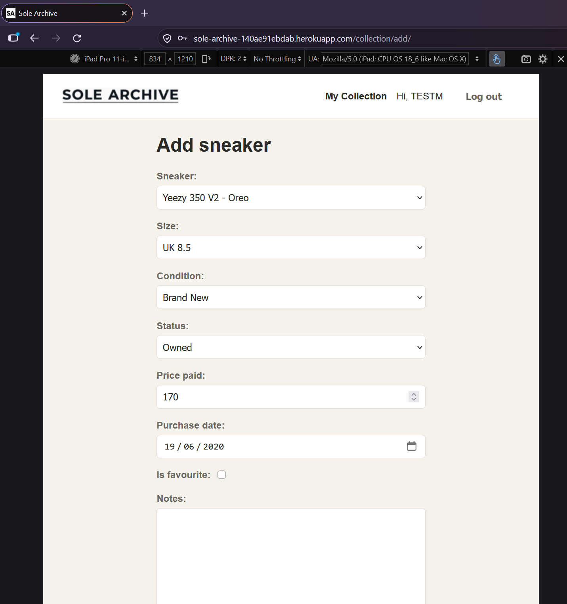 |  | Works as expected |
| Edit Sneaker |  | 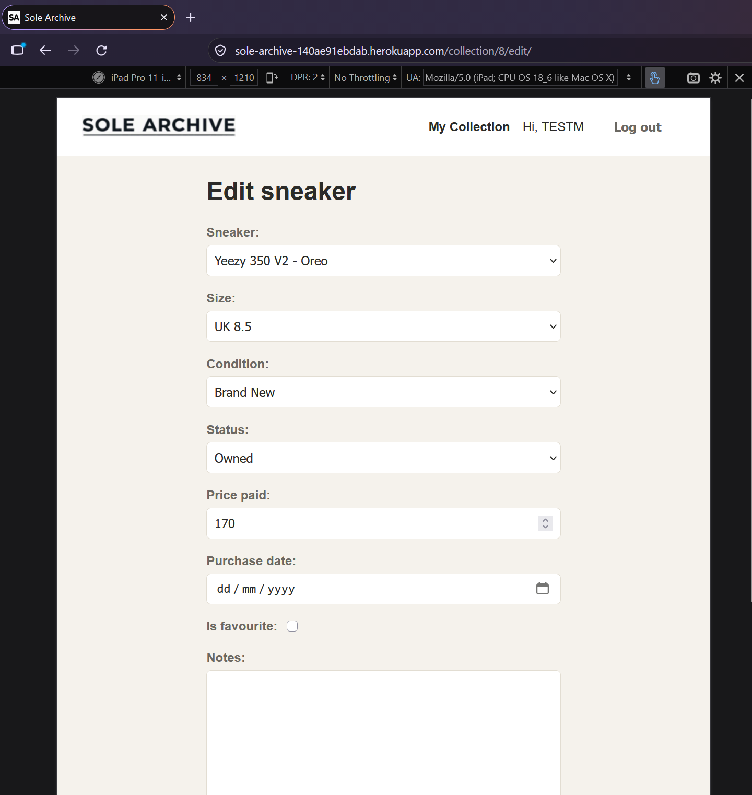 |  | Works as expected |
| Sneaker Post |  | 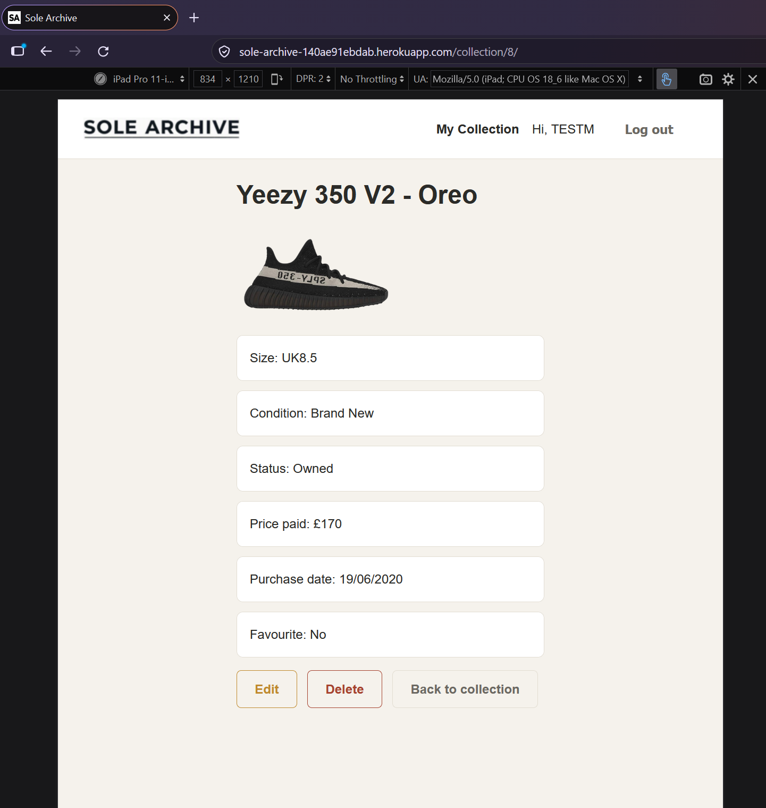 |  | Works as expected |

## Browser Compatibility

I've tested my deployed project on multiple browsers to check for compatibility issues.

| Page | Chrome | Firefox | OperaGX | Notes |
| --- | --- | --- | --- | --- |
| Register |  |  |  | Works as expected |
| Login |  |  |  | Works as expected |
| Home |  |  |  | Works as expected |
| Add Sneaker |  |  |  | Works as expected |
| Edit Sneaker |  |  |  | Works as expected |
| Sneaker Post |  |  |  | Works as expected |

## Lighthouse Audit

I've tested my deployed project using the Lighthouse Audit tool to check for any major issues. Some warnings are outside of my control, and mobile results tend to be lower than desktop.

| Page | Mobile | Desktop |
| --- | --- | --- |
| Register |  |  |
| Login |  |  |
| Home |  |  |
| Add Sneaker |  |  |
| Edit Sneaker |  |  |
| Sneaker Post |  |  |

## Defensive Programming

⚠️ INSTRUCTIONS ⚠️

Defensive programming (defensive design) is extremely important! When building projects that accept user inputs or forms, you should always test the level of security for each form field. Examples of this could include (but not limited to):

All Projects:

- Users cannot submit an empty form (add the `required` attribute)
- Users must enter valid field types (ensure the correct input `type=""` is used)
- Users cannot brute-force a URL to navigate to a restricted pages

Python Projects:

- Users cannot perform CRUD functionality if not authenticated (if login functionality exists)
- User-A should not be able to manipulate data belonging to User-B, or vice versa
- Non-Authenticated users should not be able to access pages that require authentication
- Standard users should not be able to access pages intended for superusers/admins

You'll want to test all functionality on your application, whether it's a standard form, or CRUD functionality, for data manipulation on a database. Try to access various pages on your site as different user types (User-A, User-B, guest user, admin, superuser). You should include any manual tests performed, and the expected results/outcome.

Testing should be replicable (can someone else replicate the same outcome?). Ideally, tests cases should focus on each individual section of every page on the website. Each test case should be specific, objective, and step-wise replicable.

Instead of adding a general overview saying that everything works fine, consider documenting tests on each element of the page (eg. button clicks, input box validation, navigation links, etc.) by testing them in their "happy flow", their "bad/exception flow", mentioning the expected and observed results, and drawing a parallel between them where applicable.

Consider using the following format for manual test cases:

- Expected Outcome / Test Performed / Result Received / Fixes Implemented

- **Expected**: "Feature is expected to do X when the user does Y."
- **Testing**: "Tested the feature by doing Y."
- (either) **Result**: "The feature behaved as expected, and it did Y."
- (or) **Result**: "The feature did not respond to A, B, or C."
- **Fix**: "I did Z to the code because something was missing."

Use the table below as a basic start, and expand on it using the logic above.

⚠️ --- END --- ⚠️

Defensive programming was manually tested with the below user acceptance testing:

| Page | Expectation | Test | Result | Screenshot |
| --- | --- | --- | --- | --- |
| Blog Management | Feature is expected to allow the blog owner to create new posts with a title, featured image, and content. | Created a new post with valid title, image, and content data. | Post was created successfully and displayed correctly in the blog. |  |
| | Feature is expected to allow the blog owner to update existing posts. | Edited the content of an existing blog post. | Post was updated successfully with the new content. |  |
| | Feature is expected to allow the blog owner to delete blog posts. | Attempted to delete a blog post, confirming the action before proceeding. | Blog post was deleted successfully. | 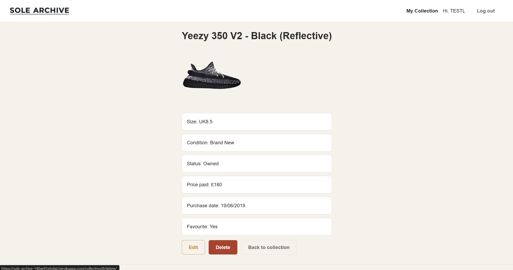 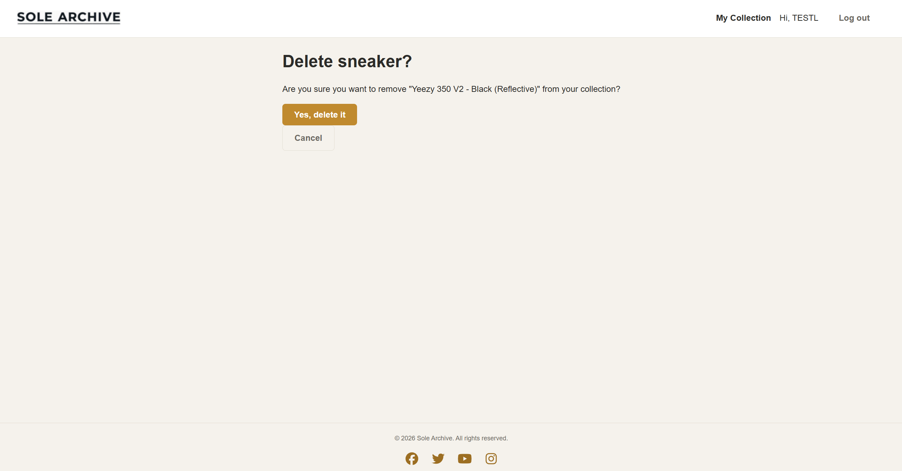 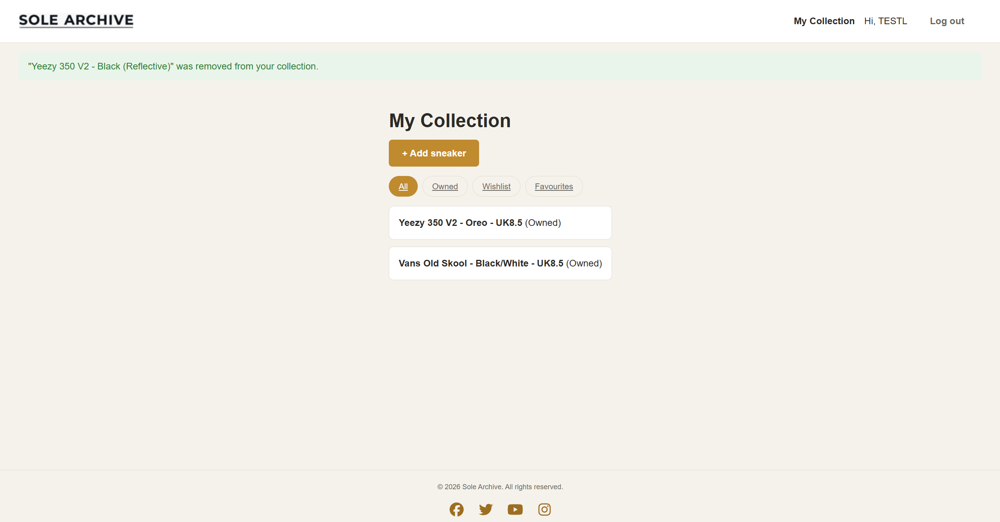 |
| Comments Management | Feature is expected to allow the blog owner to edit or delete comments. | Edited and deleted existing comments. | Comments were updated or removed successfully. |  |
| User Authentication | Feature is expected to allow registered users to log in to the site. | Attempted to log in with valid and invalid credentials. | Login was successful with valid credentials; invalid credentials were rejected. | 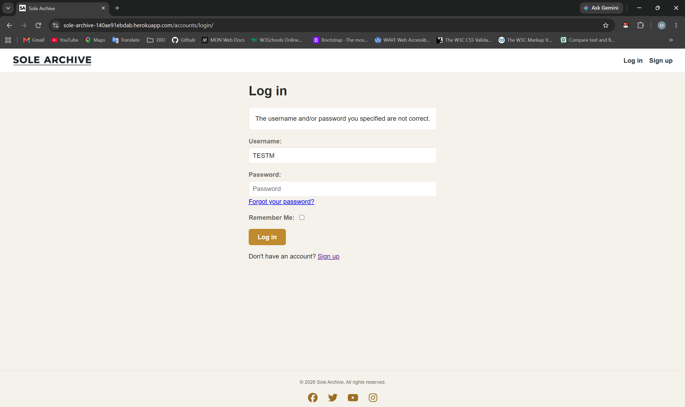 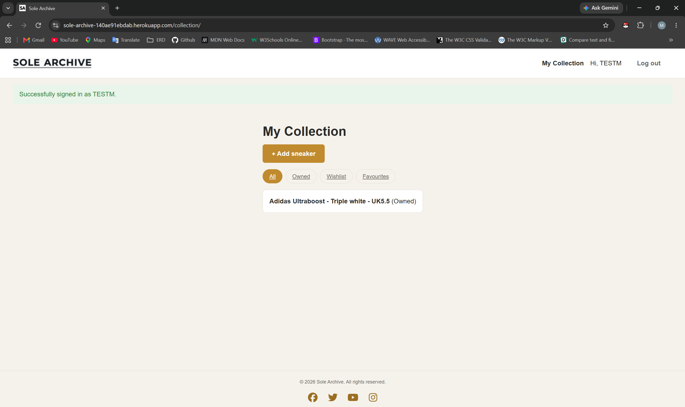 |
| | Feature is expected to allow users to register for an account. | Registered a new user with unique credentials. | User account was created successfully. | 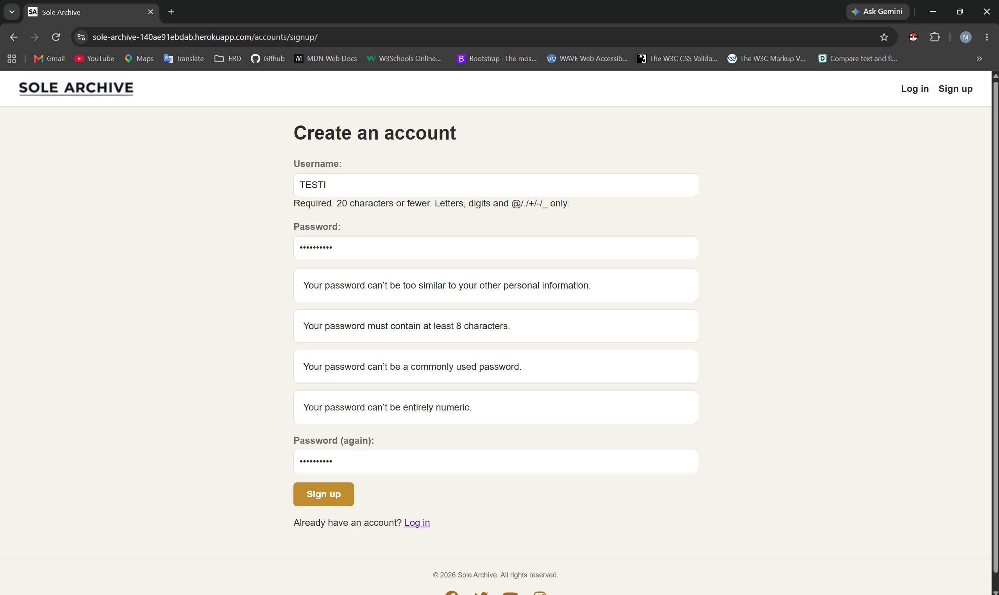 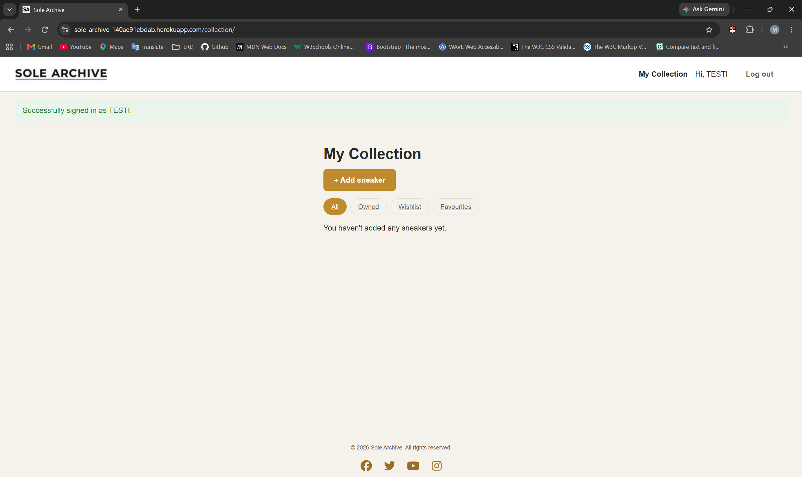 |
| | Feature is expected to allow users to log out securely. | Logged out and tried accessing a restricted page. | Access was denied after logout, as expected. |  |
| | Feature is expected to allow users to edit their own comments. | Edited personal comments. | Comments were updated as expected. | 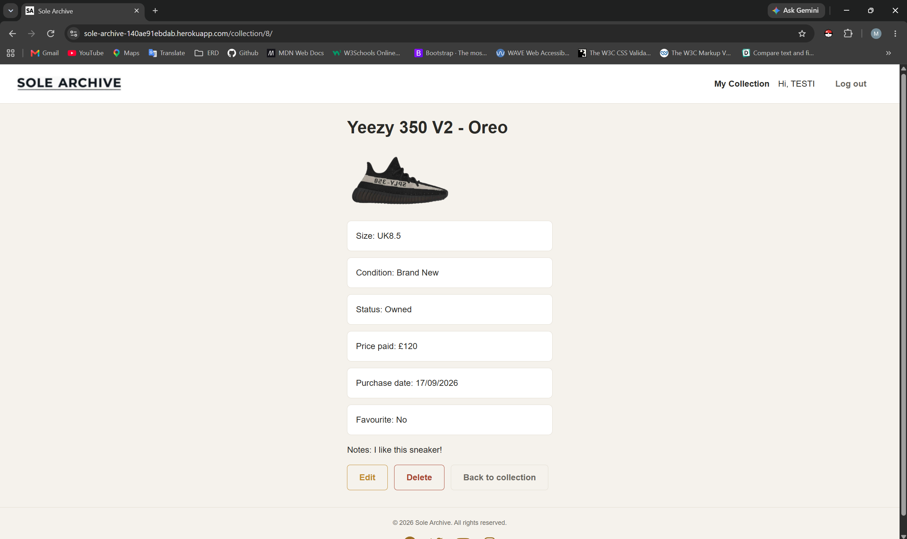 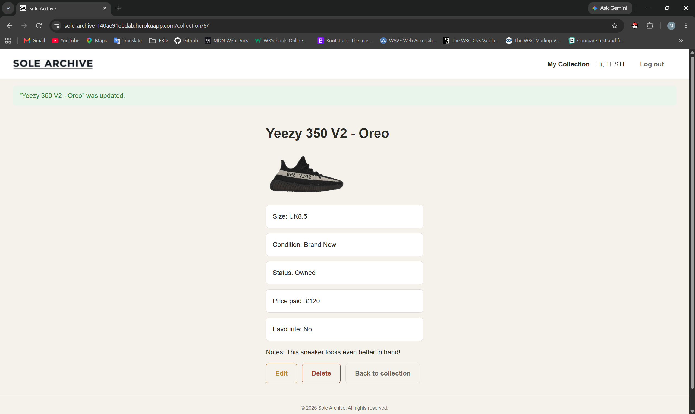 |
| | Feature is expected to allow users to delete their own comments. | Deleted personal comments. | Comments were removed as expected. | 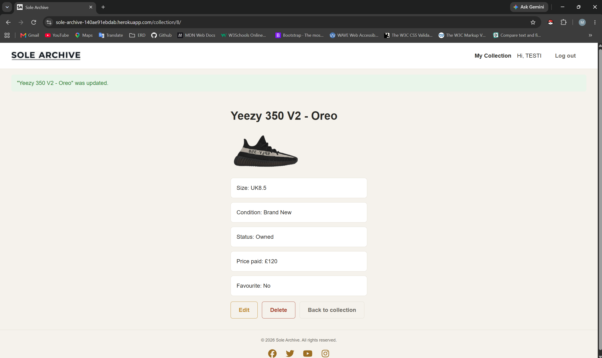 |
| | Feature is expected to block standard users from brute-forcing admin pages. | Attempted to navigate to admin-only pages by manipulating the URL (e.g., `/admin`). | Access was blocked, and a message was displayed showing denied access. | 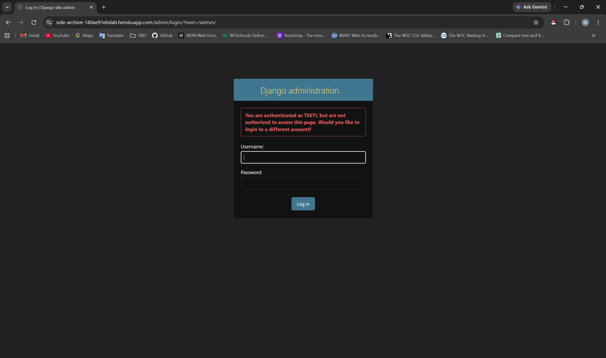 |

## User Story Testing

⚠️ INSTRUCTIONS ⚠️

Testing User Stories is actually quite simple, once you've already got the stories defined on your README.

Most of your project's **Features** should already align with the **User Stories**, so this should be as simple as creating a table with the User Story, matching with the re-used screenshot from the respective Feature.

⚠️ --- END --- ⚠️

| Target | Expectation | Outcome | Screenshot |
| --- | --- | --- | --- |
| As a blog owner | I would like to create new blog posts with a title, featured image, and content | so that I can share my experiences with my audience. |  |
| As a blog owner | I would like to update existing blog posts | so that I can correct or add new information to my previous stories. |  |
| As a blog owner | I would like to delete blog posts | so that I can remove outdated or irrelevant content from my blog. |  |
| As a blog owner | I would like to retrieve a list of all my published blog posts | so that I can manage them from a central dashboard. | 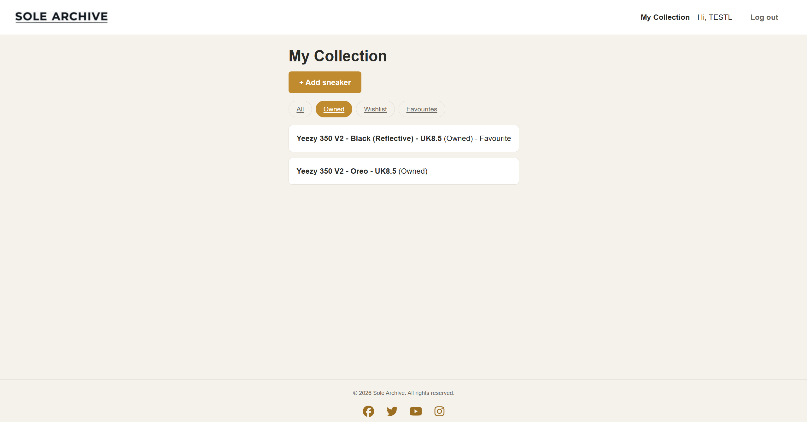 |
| As a blog owner | I would like to preview a post as draft before publishing it | so that I can ensure formatting and content appear correctly. |  |
| As a blog owner | I would like to review comments before they are published | so that I can filter out spam or inappropriate content. | 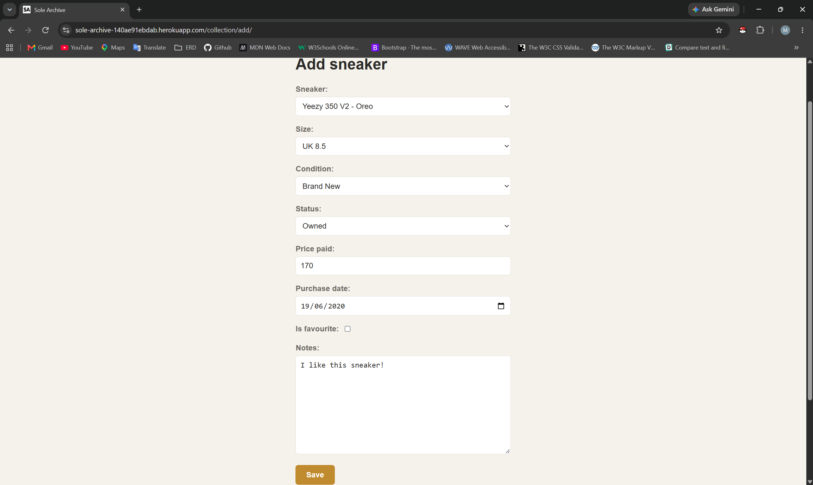 |
| As a registered user | I would like to log in to the site | so that I can leave comments on blog posts. |  |
| As a registered user | I would like to register for an account | so that I can become part of the community and engage with the blog. |  |
| As a registered user | I would like to edit or delete my own comments | so that I can fix mistakes or retract my statement. |    |
| As a guest user | I would like to register for an account | so that I can participate in the community by leaving comments on posts. |  |

## Automated Testing

I have conducted a series of automated tests on my application.

> [!NOTE]  
> I fully acknowledge and understand that, in a real-world scenario, an extensive set of additional tests would be more comprehensive.

### JavaScript (Jest Testing)

No javascript was used, therefore no validation needed.

#### Jest Test Issues

⚠️ INSTRUCTIONS ⚠️

Use this section to list any known issues you ran into while writing your Jest tests. Remember to include screenshots (where possible), and a solution to the issue (if known). This can be used for both "fixed" and "unresolved" issues. Remove this sub-section entirely if you somehow didn't run into any issues while working with Jest.

⚠️ --- END --- ⚠️

### Python (Unit Testing)

⚠️ INSTRUCTIONS ⚠️

Adjust the code below (file names, function names, etc.) to match your own project files/folders. Use these notes loosely when documenting your own Python Unit tests, and remove/adjust where applicable.

⚠️ SAMPLE ⚠️

I have used Django's built-in unit testing framework to test the application functionality. In order to run the tests, I ran the following command in the terminal each time:

- `python3 manage.py test name-of-app`

To create the coverage report, I would then run the following commands:

- `pip3 install coverage`
- `pip3 freeze --local > requirements.txt`
- `coverage run --omit="*/site-packages/*,*/migrations/*,*/__init__.py,env.py,.env" manage.py test`
- `coverage report`

To see the HTML version of the reports, and find out whether some pieces of code were missing, I ran the following commands:

- `coverage html`
- `python3 -m http.server`

Below are the results from the full coverage report on my application that I've tested:

#### Unit Test Issues

## Bugs

### Fixed Bugs

I've used [GitHub Issues](https://www.github.com/minhqla/sole-archive/issues) to track and manage bugs and issues during the development stages of my project.

All previously closed/fixed bugs can be tracked [here](https://www.github.com/minhqla/sole-archive/issues?q=is%3Aissue+is%3Aclosed+label%3Abug).

### Unfixed Bugs

Any remaining open issues can be tracked [here](https://www.github.com/minhqla/sole-archive/issues?q=is%3Aissue+is%3Aopen+label%3Abug).

### Known Issues

| Issue | Screenshot |
| --- | --- |
| The project is designed to be responsive from `375px` and upwards, in line with the material taught on the course LMS. Minor layout inconsistencies may occur on extra-wide (e.g. 4k/8k monitors), or smart-display devices (e.g. Nest Hub, Smart Watches, Gameboy Color, etc.), as these resolutions are outside the project’s scope, as taught by Code Institute. |  |
| Validation errors on "signup.html" coming from the Django Allauth package. | 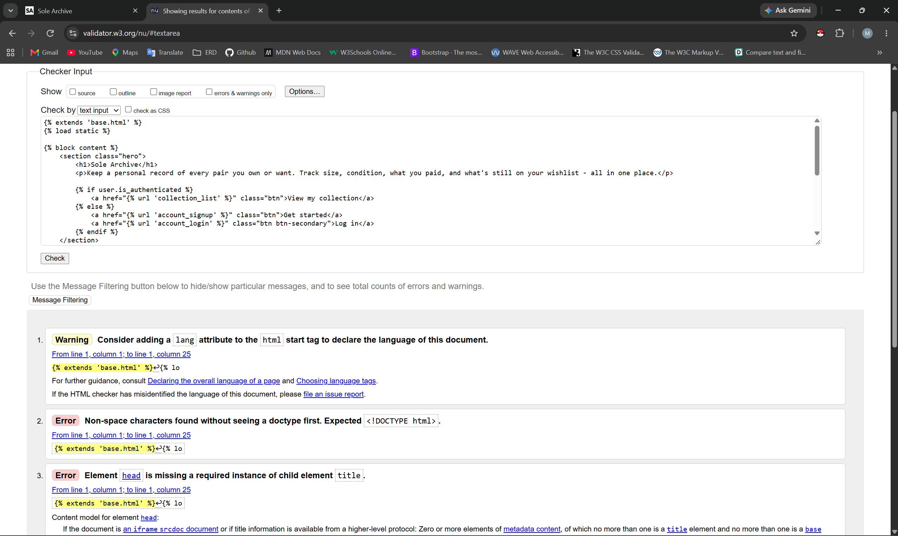 |

> [!IMPORTANT]  
> There are no remaining bugs that I am aware of, though, even after thorough testing, I cannot rule out the possibility.

